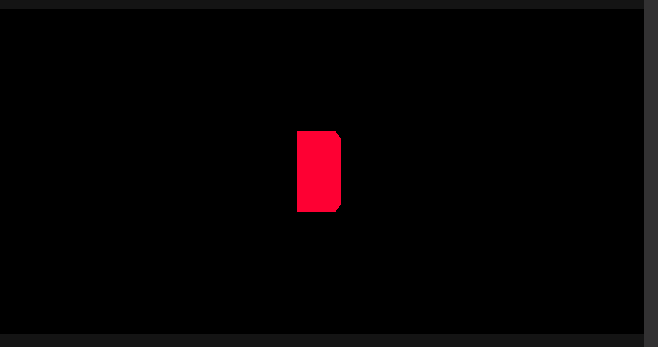

<!--
SPDX-License-Identifier: MPL-2.0

This file is part of Ramses Composer
(see https://github.com/bmwcarit/ramses-composer-docs).

This Source Code Form is subject to the terms of the Mozilla Public License, v. 2.0.
If a copy of the MPL was not distributed with this file, You can obtain one at http://mozilla.org/MPL/2.0/.
-->

# Animations
*You can find the example project {{ '[here]({}/doc/advanced/animations)'.format(repo) }}.*



This tutorial shows how to import animation data using the glTF format.

## A general note on animation data

Animation data can typically grow large and cause performance problems if not carefully optimized.
glTF offers a good compromise between animation quality and exported data size. In order to utilize glTF
to its best, it's advised to get a good understanding how the different interpolation mechanisms work, and
most importantly - consult the documentation of your DCC tool of choice regarding keyframe conversion and
compression.

## Creating a simple animation with Blender

In this tutorial, we use the excellent glTF exporter of Blender 2.83 LTS. You can just use
 {{ '[the existing scene in the Blender subfolder]({}/doc/advanced/animations/blender)'.format(repo) }} or create it yourself by following the steps below.

* Select the default blender cube in a new project
* In the animation panel, change the "End" frame from 250 to 60 to reduce the animation time
* Select the 1st frame in the animation editor
* Press 'i' for recording keyframes
* From the dropdown menu, select "Rotate, scale, and translate" keyframe type
* Enter some values in the property fields - e.g. set the scaling to 1, 2, 3
* Move to frame 60
* Press 'i' again, select some other values for the last keyframe (e.g. random rotation, translation and scale values)

Next, we need to export the cube alongside its animation using the glTF export menu. For details how to export
from Blender, check {ref}`the corresponding section of the basic cube tutorial <basics/hello_world/readme:Export glTF from Blender>`.

Make sure you click the "Export Animations" setting in the export menu:


If you uncollapse the "Animation" export menu, you will notice a setting called "Always sample animations". It's
on by default, but what it causes is that every single frame results in a data point in the resulting glTF file.
So if you have a simple linear animation over 120 frames, you will export 120 data points instead of just two (which would
result in the exact same visual result as 120 key points). We suggest not using this feature of the exporter, unless really
needed.

## Importing the animation

Let's import the animated cube in the Ramses Composer. If you haven't yet, check out the
{ref}`section in the glTF import tutorial <advanced/complex_import/readme:Scene graph and resources>`
which explains how to import complex glTF files. When importing
the glTF file, you will notice the animation resources in the list of available items to import:


After importing those, you will see the animation channels in the resource menu:


You can inspect their properties in the property panel:


Notice that the keyframes are 2 instead of 60. This is because we didn't subsample the animation during export, but
use cubic spline interpolation to achieve a smooth animation instead.

Furthermore, the scene graph now contains a Node which also has an animation object assigned to it:


The animation is statically assigned to the node and its outputs are linked to the node transformation properties.
You can experiment with the `progress` input of the animation object to see the animation in different phases/states:


If you want to preview the animation in the Composer, you can create a `Timer` object (in the Resources View) and link
it to a control script which translates timer ticks to a normalized [0, 1] value which is linked to the animation `Progress` input.

Your script can look like this:

```lua

function interface(IN,OUT)
    IN.ticker = Type:Int64()
    OUT.animationProgress = Type:Float()
end

function run(IN,OUT)
    -- Total duration of the animation in seconds
    local durationInSeconds = 3
    -- How many microseconds are needed to fill the progress from 0 -> 1
    local normalizeFactor = 1000000 * durationInSeconds
    -- Convert timer ticks to progress and normalizing to [0, 1]
    local progress = (IN.ticker % normalizeFactor) / normalizeFactor
    OUT.animationProgress = progress
end

```

Now you can link the script's animationProgress output to the Animation's `Progress` input.
This works exactly as with other scripts, see the
{ref}`section on linking Lua properties in the Monkey example <basics/monkey/readme:Lua Scripting>`
for details.

You can do any transformation - you can stop at a given point, reverse the animation, or rewind to a given point.
you have the full freedom of Lua to define the logic to translate the time ticks to animation state/progress.
