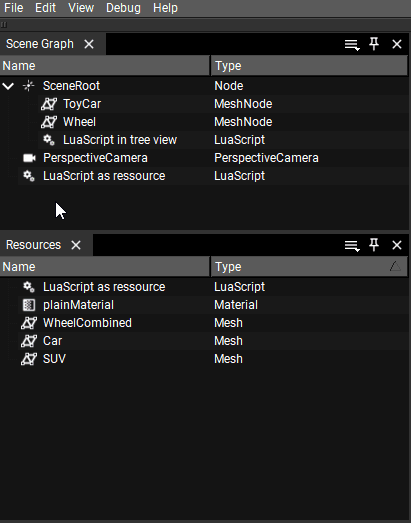

<!--
SPDX-License-Identifier: MPL-2.0

This file is part of Ramses Composer
(see https://github.com/bmwcarit/ramses-composer-docs).

This Source Code Form is subject to the terms of the Mozilla Public License, v. 2.0.
If a copy of the MPL was not distributed with this file, You can obtain one at http://mozilla.org/MPL/2.0/.
-->

# Lua Syntax
The Ramses Composer relies on the [Ramses Logic Engine](https://github.com/bmwcarit/ramses-logic) to load, parse and execute `Lua` scripts and to capture and report errors.
You can find the user documentation of the `Lua` syntax dialect and its specifics at a dedicated section of the `Logic Engine` docs [here](https://ramses-logic.readthedocs.io/en/latest/lua_syntax.html).

You can find the exact version of the `Logic Engine` used by the Composer in the Help->About menu.

## Introduction to Lua

This section explains the basics about _Lua_ scripts and how to use them interactively with the _Ramses Composer_.

### Why should you use Lua scripts

Using _Lua_ scripts is generally optional, you don't need them to create a basic, static 3D scene.
However, they allow you to include dynamic behaviour and some business logic in your scene. They enable you to create interfaces and "translate" given information to an specific behaviour and pass on this information via _links_.

For example:
* you get information about the traveled distance as `float`
* the tires of your asset should be turning based on the draveled distance
* so you convert the "distance float" to one axis of a vector(3) in a Lua script and link this vector to the rotation property of your vehicle's wheel.

This way you can translate potentially application-specific data (the travel distance of a car in meters) to the abstract representation of a 3D scene (the vector3 rotation property in this example). As you guessed, you can then extend the Lua scripts to do more things - use different metrics, simulate different inputs etc. while not changing the wheel object itself.
Of course Lua can be useful to make debugging easier, e.g. by emitting debug data.

### How to include and use your Lua scripts

There are two different ways to use Lua scripts in your scene / project.
* included in your scene graph (red arrow)
* as a resource, visible both on top level in the *Scene Graph* view and in the *Resources* View (blue arrow)


#### What's the difference?
Basically all *Lua* scripts work in the same way, regardless of their location, this is just a feature to allow you to get them organized conveniently within your project.

If you put them as children of a Node into the scene graph, you can group them logically and
keep object specific behaviour closely together. You can always change their location and
order if you like. This topic is particularly interesting for including Lua scripts in
[Prefabs](../prefabs/README.md).

_Lua_ scripts in your Resources view also appear on top level in the Scene Graph. They are easy to find and immediately accessible. This might be the right place for scene-level functionality or scene input.

#### Including Lua to your project
Open the context menu in your scene graph using right click and select `Create LuaScript` as shown. Make sure not to confuse LuaScripts with LuaInterfaces, those will be explained later in the aforementioned prefabs tutorial.
When you execute this step in an empty area of your scene graph or in your resource browser, an independent (empty) Lua script object is created. In case of right click on a node in your scene graph, a _Lua_ script object will be created inside of your scene graph.



Currently it's still an empty Lua "node" and marked with an empty orange `URI` to indicate that something is missing here.
Click on the tree dots `...` (red arrow) and select a Lua script in your project folder.


If you have assigned an existing _Lua_ script you can edit this using an editor like _Notepad++, ZeroBrane, Visual Studio Code_ or whatever you prefer.

Hint: You need to define a standard application editing _.lua_ file extensions in your operating system, you can use the `pencil`-symbol (blue arrow) to open this tool directly.

If you create several Lua script objects with the same URI, this means that you have several instances of the script. They will behave in the same way, but they all have independent sets of input and output parameters and variables.

## Understanding errors

### Parsing Errors

If your LuaScript contains a parsing error, an error message will be displayed at the top of a property browser for the LuaScript.
As an example, if your script is

```Lua
function interface(IN,OUT)
    IN.value = Type:Int32()
    OUT.value = Type:String()
end

fnction run()
    OUT.value = IN.value
end
```

you will see the following error message at the top of the property browser for the script:


In this example, the script has a syntax error in line 7 - "fnction" needs to be replaced with "function" to fix the error.

### Runtime Errors

Besides parsing errors, LuaScripts can also cause runtime errors - errors which only occur when the script is run. Take this example assigning an integer to a string
in line 10 if "choice" is greater than 0:

```Lua
function interface(IN,OUT)
    IN.choice = Type:Int32()
    IN.value = Type:Float()

    OUT.value = Type:String()
end

function run(IN,OUT)
    if IN.choice > 0 then
        OUT.value = IN.value
    end
end
```

Runtime errors show up at the top of the property browser for the script, just as the parsing errors do:


Note that the runtime error only occurs if the line with the runtime error is actually executed - in this example "choice" must be set to a value greater than 0 for the
error to occur and be displayed.

Ramses Logic stops processing the LuaScripts once it encounters a runtime error. To alert the user that a runtime error occurred and not all scripts
have been processed, a warning is displayed in the property browser for all LuaScripts:


### Debugging

To obtain information from inside a script Ramses Logic supports several debugging functions. These are `rl_logInfo`, `rl_logWarn`, and `rl_logError` which all take a single string argument. They generate a log message of the appropriate catogory which is visible in the log view. These functions are only enabled in normal operation both in the GUI and headless applications but will be disabled if the scene is setup for export. Calling these functions in a Lua script will therefore result in an export failure.

As an example consider the following script:
```Lua
function interface(IN,OUT)
    IN.choice = Type:Int32()
end

function run(IN,OUT)
    if IN.choice < 0 then
        rl_logError(string.format("choice < 0: %s", IN.choice))
    elseif IN.choice == 0 then
        rl_logWarn("choice == 0")
    else 
        rl_logInfo(string.format("choice > 0: %s", IN.choice))
    end
end
```
Depending on the input variable an info, warning, or error message is generated including the current value of the input. This log message will be generated every time the script is executed.


## Shortcuts and Tricks

There are a lot of coding styles and individual preferred structures if you create a Lua script for your projects. Here are some typical use cases which can help save a bit of work time and performance.

### Suggestions for Readability

As you know, we can use different types of data, `int`, `float`, `string` and `vectors` of size 2, 3 and 4. As a recommendation, if you use an `IN` property more than one time in your script, you should assign it to a local value, it's much faster!

You should be familiar with these data types, but just as a short reminder, vectors can be used like arrays:

```Lua
function interface(IN,OUT)
    IN.myVec4 = Type:Vec4f()
    OUT.myOutVec4 = Type:Vec4f()
    OUT.myOutVec3 = Type:Vec3f()
    OUT.myFirstVec2 = Type:Vec2f()
    OUT.mySecondVec2 = Type:Vec2f()
end

function run(IN,OUT)
    local vec4 = IN.myVec4
    OUT.myOutVec4 = vec4
    OUT.myOutVec3 = {vec4[1], vec4[2], vec4[3]}
    OUT.myFirstVec2 = {vec4[1], vec4[2]}
    OUT.mySecondVec2 = {vec4[3], vec4[4]}
end
```


To some Lua script users, this vector syntax may not be very readable **{ }**.
A small convenience function can help us and reveal a special Lua feature at the same time.

```Lua
function vec(...)
    return {...}
end
```

No, that's not a pseudo source code, it's native Lua. This function can take 0-N parameters and returns them as a `table`, which makes our `OUT` declarations work all the same:

```Lua
function run(IN,OUT)
    local vec4 = IN.myVec4
    OUT.myOutVec4 = vec4
    OUT.myOutVec3 = vec(vec4[1], vec4[2], vec4[3])
    OUT.myFirstVec2 = vec(vec4[1], vec4[2])
    OUT.mySecondVec2 = vec(vec4[3], vec4[4])
end
```

### Using and assigning structs

You can create structs to bundle data, but there is no reason to copy/paste your code snippet again and again like this.

```Lua
function interface(IN,OUT)
    IN.my_IN_Struct = {name = Type:String(), age = Type:Int32(), height_meter = Type:Float()}
    OUT.my_OUT_Struct = {name = Type:String(), age = Type:Int32(), height_meter = Type:Float()}
end

function run(IN,OUT)
    OUT.my_OUT_Struct = IN.my_IN_Struct
end
```

As a shortcut create a local struct(-value) in your `interface()` function and use this definition as a type alias, like `typedef` in _C_.
_(this only works in the `interface()` function)_

```Lua
function interface(IN,OUT)
    local setting_person = {name = Type:String(), age = Type:Int32(), height = Type:Float()}
    IN.my_IN_Struct = setting_person
    OUT.my_OUT_Struct = setting_person
end

function run(IN,OUT)
    OUT.my_OUT_Struct = IN.my_IN_Struct
end
```
It's much more readable and you don't need to adjust the assignments in your `run()` function - another side effect, this approach eliminates struct assignment mismatches!

### Array vs loop

Sometimes you need to create a kind of array as `IN` or `OUT`, but it's important the label starts with its own defined name like `my_sensor_0`.

```Lua
function interface(IN,OUT)
    OUT.my_sensor = Type:Array(3, Type:Bool())

    for i = 0, 2 do
      OUT["my_sensor_" .. i] = Type:Bool()
    end
end
```
Keep in mind, _Lua_ array indexes start at one instead of zero! The result looks like this:


Input properties can be generated the same way, but you can't assign the values the same way as with a parameter defined as a `struct`. Every single element need its own assignment.

```Lua
function run(IN,OUT)
    OUT.my_sensor_0 = true
    OUT.my_sensor_1 = true
    OUT.my_sensor_2 = true
end
```
Of course you can also assign the values in a loop, similar to our approach in the `interface()` function.

```Lua
function run(IN,OUT)
    for i = 0, 2 do
        OUT["my_sensor_" .. i] = true
    end
end
```

## Complex scripts
Sometimes you need a much more complex way to create a solution, for such cases you should read this section.

### Thinking objectively
If you prefer to think in an object-oriented way, you can also create objects in Lua scripts. At first you create a simple local `table`, but define this outside of your functions `run()` and `interface()` so it's global in Lua.

```Lua
local class_Person = {
    age = 0,
    height = 0.0,
    name = "unknown"
}
```

But this is still a struct and not an object, so define a function inside this struct and use the object pointer `self`, without using a new local value.

```Lua
local class_Person = {
    age = 0,
    height = 0.0,
    name = "unknown",
    print = function(self)
        print(  "Name: " .. self.name ..
                ", age: " .. self.age ..
                ", height: " .. self.height)
    end,
    reset = function(self)
        self.age = 0
        self.height = 0.0
        self.name = "unknown"
    end
}
```

Now our _Lua-class_ is defined and we can try to set some values and call its methods. Note that the syntax is with `:` instead of `.` .

```Lua
function run(IN,OUT)
    class_Person.age = 18
    class_Person.height = 1.65
    class_Person.name = "Max Mustermann"
    class_Person:print()
    class_Person:reset()
    class_Person:print()
end
```

Log output:

```
TestLua: Name: Max Mustermann, age: 18, height: 1.65
TestLua: Name: unknown, age: 0, height: 0
```

Sure - it's not really handy to define the same method in every single object and a globally defined function could be in conflict with other objects, so we define a _base class_, define our methods there and make our _person class_ *inherit* this _base class_.

Our global function, which is comparable with
**[condition] ? [result a] : [result b]** in _C++_

```Lua
function select(a, x, y)
    if a then
        return x
    else
        return y
    end
end
```

Also we define a method in _base class_, which iterates through all variables and sets them to a default value if they exist.

```Lua
local class_basic = {
    reset = function(self)
      for key, value in pairs(self) do
        local _type = type(value)
        if _type ~= "function" then
          self[key] = select(_type == "number", 0,
                        select( _type == "string", "unknown" ,false))
        end
      end
  end
}
```

And we `inherit` this function of our _base class_ in the `class_Person` object, which we can do with all other `tables`, too.

```Lua
local class_Person = {
    -- [...] (known part ahead)
    reset = class_basic.reset
}
```

The log result has the same output. At this point, have a closer look how it's written (assigned like a value, not as a function) and keep the order in mind. `class_basic` must exist before `class_Person`.

And yes, you are right - it's similar to a static object in _C++_. How could we handle an instance of this, because we want to use a couple of individual people?
Add this to our `class_basic`:

```Lua
new = function (self, o)
    o = o or {}   -- create object if user does not provide one
    setmetatable(o, self)
    self.__index = self
    return o
end
```

So we can finally instantiate our "class".

```Lua
local class_Person = {
    age = 0,
    height = 0.0,
    name = "unknown",
    print = function(self)
        print("Name: " .. self.name .. ", age: " .. self.age .. ", height: " .. self.height)
    end,
    reset = class_basic.reset,
    new = class_basic.new
}
```
And use the instantiation e.g. like this:


```Lua
function run(IN,OUT)
    local persons = {
      A = class_Person:new(),
      B = class_Person:new()
    }

    persons.A.name = "Max Bauer"
    persons.B.name = "Karl Heinz"

    persons.A:print()
    persons.B:print()
end
```

Log:

```
TestLua: Name: Max Bauer, age: 0, height: 0
TestLua: Name: Karl Heinz, age: 0, height: 0
```

Make sure you create the instances with `new()`. Without it this would happen:

```Lua
function run(IN,OUT)
    --this is a bad idea
    local persons = {
      A = class_Person,
      B = class_Person
    }

    persons.A.name = "Max Bauer"
    persons.B.name = "Karl Heinz"

    persons.A:print()
    persons.B:print()
end
```

Log:

```
TestLua: Name: Karl Heinz, age: 0, height: 0
TestLua: Name: Karl Heinz, age: 0, height: 0
```

It's because our `class_Person` is assigned as a `table` reference - so it's the same object.

### Make struct output assignments easier
So, currently we have objects to store our data and they can have their own _output_ functions - which is sometimes needed of course. But this isn't really handy and we want an easier way to handle this.

What we have:
* `class_basic` (to get our methodes `reset()` & `new()`)
* `class_Person`
* global function `select` (our shortcut for if-else)
* empty `interface()`
* `run()` function to set our data

There is still one task remaining, to match our input or output properties in `interface()` with our "objects" (still `tables`) - but we can do it a bit smoother than assigning all data manually.

As a reminder, our `class_Person` looks like this and includes different data types (`int`, `float`, `string` & `functions`).

```Lua
local class_Person = {
    age = 0,
    height = 0.0,
    name = "unknown",
    print = function(self)
        print(  "Name: " .. self.name ..
                ", age: " .. self.age ..
                ", height: " .. self.height)
    end,
    reset = class_basic.reset,
    new = class_basic.new
}
```

So if we define a local `person` struct in our `interface()` with exactly the same members as our object (but without `functions`, of course ), we will be able to automatically assign the values of our `class_Person` instances (more or less):

```Lua
function interface(IN,OUT)
    local person = {
        age = Type:Int32(),
        height = Type:Float(),
        name = Type:String() }
    --in this case, we don't need to declare a new local table (struct) - just for a better overview.
    OUT.Member = Type:Array(2, person)
end
```

The result should look like this, an empty array of structs:


What we now need is a function that compares and sets all primitive properties of our two instanciated objects and assigns the property values of the first to the property values of the second object.
There are variations of how to do this, smaller scripts don't need this kind of structure!

In this case, we'll define a global function to do this job and call it after everything is done - so in the end of `run()`.

```Lua
--go through the structure and set each matching output
function setStruct(out, input)
    for key, value in pairs(input) do
        if type(value) ~= "function" and type(value) ~= "table" then
            out[key] = value
        end
    end
end
```

What exactly happens:

The parameter `out` represents our `OUT.xxx` property and input our matching "object".

Then we parse our `table` for each entry and assign it to a local value. After this we check what kind of value we have `type(value)` and ignore all `functions` and `tables` (to avoid recursive functions). At the end we use the name of this value to catch the matching one in our `OUT` and assign the value from our input to the property of the same name in `out`.


```Lua
--it's now a "global" variable
persons = {}

function run(IN,OUT)

    persons = {
      A = class_Person:new(),
      B = class_Person:new()
    }

    persons.A.name = "Max Bauer"
    persons.A.age = 22
    persons.A.height = 1.85

    persons.B.name = "Karl Heinz"
    persons.B.age = 65
    persons.B.height = 1.61

    setStruct(OUT.Member[1], persons.A)
    setStruct(OUT.Member[2], persons.B)
end
```

Now our result should look like this:


